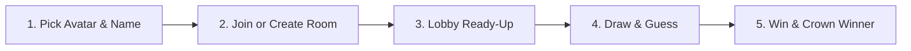
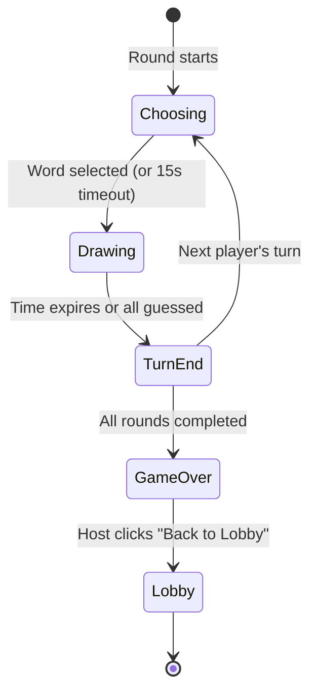

# 🎨 Scribbly

<div align="center">

<p align="center">
  <strong>A fast, real-time multiplayer drawing and guessing game inspired by skribbl.io.</strong>
  <br />
  One player draws a secret word while everyone else scrambles to guess it in the chat!
</p>

[](https://react.dev/)
[](https://www.typescriptlang.org/)
[](https://vitejs.dev/)
[](https://nodejs.org/)
[](https://expressjs.com/)
[](https://socket.io/)

<br />

🚀 **[Play Live Demo](https://scribbly-clone.vercel.app)** 🚀

</div>

> [!NOTE]  
> **Cold Start Warning:** The backend is hosted on Render's free tier and spins down during periods of inactivity. The initial room load or connection may take approximately **30 seconds** to wake up.

---

## 📑 Table of Contents

- [✨ Features](#-features)
  - [🎮 Core Game](#-core-game)
  - [⚙️ Customizable Room Settings](#️-customizable-room-settings)
  - [🌟 Extra Features](#-extra-features)
- [🕹️ How to Play](#️-how-to-play)
- [🚀 Quick Start (Running Locally)](#-quick-start-running-locally)
- [📁 Project Layout](#-project-layout)
- [🏗️ Architecture & Implementation](#️-architecture--implementation)
  - [1. Server-Authoritative State & Anti-Cheat](#1-server-authoritative-state--anti-cheat)
  - [2. Game Loop & Lifecycle](#2-game-loop--lifecycle)
  - [3. Real-Time Canvas Pipeline](#3-real-time-canvas-pipeline)
  - [4. Smart Guess Matching & Multilingual Support](#4-smart-guess-matching--multilingual-support)
  - [5. Moderation System](#5-moderation-system)
  - [6. Disconnects & Fault Tolerance](#6-disconnects--fault-tolerance)
- [📡 Socket.IO Event Reference](#-socketio-event-reference)
- [🚢 Deployment Guide](#-deployment-guide)

---

## ✨ Features

### 🎮 Core Game
- **Flexible Room Creation:** Create customized rooms, join via direct link or 6-character room codes.
- **Matchmaking Modes:** Public and private rooms with an instant **Quick Play** button for public games.
- **Pre-Game Lobby:** Interactive player lobby with custom avatars, real-time ready-up statuses, and host-controlled start.
- **Turn-Based Rounds:** Dynamic drawer rotation, customizable 1–5 word selection prompt, live guess stream, real-time scoring, live leaderboards, and podium celebration.
- **Drawing Suite:** Responsive HTML5 canvas featuring:
  - 🖌️ Smooth paintbrush
  - 🎨 12 curated color palettes
  - 📏 3 brush widths
  - 🧽 Eraser tool
  - ↩️ One-click Undo
  - 🗑️ Clear canvas button (drawer-exclusive)
- **Dynamic Hints & Timers:** Automated hints that reveal letters progressively, paired with synchronized countdown timers.

### ⚙️ Customizable Room Settings
*All settings are validated server-side to guarantee fairness:*

| Setting | Range / Options | Description |
| :--- | :--- | :--- |
| **Players** | `2` to `20` | Minimum and maximum lobby capacity |
| **Rounds** | `2` to `10` | Total rounds per game |
| **Draw Time** | `15s` to `240s` | Seconds allocated per turn |
| **Word Choices** | `1` to `5` | Words presented to the drawer each round |
| **Hints** | `0` to `5` | Letter hints revealed (`0` disables hints) |
| **Word Mode** | Normal, Hidden, Combination | Rules for how words appear and construct |
| **Language** | English, Hindi, Spanish | Multi-language localized dictionaries |
| **Categories** | Multiple packs | Specific themed word lists |
| **Custom Words** | User-defined list | Custom host vocabulary list |

### 🌟 Extra Features
- 🔤 **Unique Word Modes:**
  - **Normal:** Standard masked blank lines (`_ _ _ _`).
  - **Hidden:** Stealth mode—no blanks or letter counts shown.
  - **Combination:** Drawer must illustrate two merged concepts (e.g., `"Sun"` + `"Fish"`).
- 🌐 **Multilingual Word Packs:** Built-in dictionaries for **English**, **Hindi**, and **Spanish**.
- ✏️ **Custom Words:** Hosts can supply custom vocabulary lists, either exclusively or blended with default packs.
- 🛡️ **Comprehensive Moderation:**
  - Host kick & IP-based ban.
  - Democratic **Vote-kick** (requires a majority consensus among non-target players).
  - Player reporting system with 5 categorized reasons (alerts host & logs to server).
- 🎭 **Custom Avatars:** Choose personal avatars before jumping into any match.
- 👁️ **Spectator Mode:** Join games as a viewer using invite codes or links without taking a player slot.
- 🎬 **Stroke-by-Stroke Replay:** After each turn, watch an animated replay of how the artwork was created stroke by stroke.

---

## 🕹️ How to Play



1. **Setup:** Select your favorite avatar and display name, then hit **Quick Play**, enter a room code, or create a custom room.
2. **Invite Friends:** Share the room code or invite link (e.g. `/?room=ABC123`). Select **Watch** instead of **Join** to spectate.
3. **Lobby:** Players toggle **"I'm ready"**. The host starts the match once at least 2 players are ready.
4. **Game Loop:** The chosen drawer selects a word and illustrates it on the canvas. Guessers type answers into the chat box.
5. **Score & Win:** Faster correct guesses earn more points. After the final round, the player with the highest score takes the crown!

---

## 🚀 Quick Start (Running Locally)

### Prerequisites
- **Node.js** v18 or newer
- **npm** (comes bundled with Node)

### 1. Development Mode

Clone the repository and install all dependencies for the workspace, client, and server:

```bash
# Install root, client, and server dependencies
npm run install:all

# Start both client and server concurrently
npm run dev
```

- **Client:** `http://localhost:5173` (proxies Socket.IO requests to the backend)
- **Server:** `http://localhost:3001`

> [!TIP]
> Open `http://localhost:5173` in 2 or 3 separate browser tabs or private windows to simulate multiplayer matches locally!

### 2. Production Build

To test the unified single-process production build:

```bash
npm run build
npm start
```

Visit **`http://localhost:3001`** (Express serves both the compiled Vite frontend and Socket.IO).

---

## 📁 Project Layout

```
skribbl-clone/
├── server/src/
│   ├── index.js       # Express server, Socket.IO handlers, routing events to room methods
│   ├── Room.js        # Manages players, spectators, host, settings, moderation & per-player state snapshots
│   ├── Game.js        # Turn phases, order, timers, hints, score calculations & replay strokes
│   ├── Player.js      # Player model: id, name, avatar, score, ready state, guess status
│   ├── words.js       # Word list loader & picker (normal, custom, combination modes)
│   ├── words/         # JSON dictionaries (en.json, hi.json, es.json)
│   └── utils.js       # Unicode normalization, Levenshtein distance check, masking & room codes
│
└── client/src/
    ├── App.tsx        # Top-level state listener, router & active screen switch
    ├── pages/         # Page views: Home, Lobby, Game
    ├── components/    # UI Components: Canvas, Toolbar, TopBar, Chat, PlayerList,
    │                  # SettingsForm, WordChoice, ScoreOverlay, ReplayModal, Avatar
    └── paint.ts       # Shared canvas rendering routines for live drawing & replay playback
```

---

## 🏗️ Architecture & Implementation

### 1. Server-Authoritative State & Anti-Cheat

```
+--------------------------------------------------------------------------+
|                              SERVER (Memory)                             |
|                                                                          |
|   Room Map -> Room Instance -> Game Instance                             |
|                                                                          |
|   Builds Tailored Snapshots (`game_state`):                              |
|   - Drawer:          Full word & drawing permissions                     |
|   - Guessed Players: Revealed word, chat routed to guessed-only room     |
|   - Guessers:        Masked word (_ _ _), hints, no word leakage         |
|   - Spectators:      Masked word, separate spectator chat                |
+-------------------------------------+------------------------------------+
                                      |
              +-----------------------+-----------------------+
              | Personal `game_state`                         | Personal `game_state`
              v                                               v
    +-------------------+                           +-------------------+
    |   Client A (Guesser)|                         |  Client B (Drawer)|
    |   Renders snapshot  |                         |  Renders canvas   |
    +-------------------+                           +-------------------+
```

- **Zero Database / Pure In-Memory:** Rooms are held in a server-side JavaScript `Map`. Each `Room` manages its players and its active `Game`.
- **Zero-Trust Information Security:** The secret word is never transmitted over the network to players who haven't guessed it yet.
- **Client as a Pure Renderer:** The client contains no game state authority—it solely renders the personalized `game_state` snapshot received from the server.
- **Anti-Cheat Drawing Checks:** Drawing events originating from any client other than the active drawer are rejected on the server.

### 2. Game Loop & Lifecycle



- **Phase Transitions:** `choosing` (15s limit) &rarr; `drawing` (countdown timer) &rarr; `turn_end` (4s results screen) &rarr; next turn or `game_over`.
- **Fair Timer Management:** Time is sent as *time remaining* rather than absolute timestamps. Clients decrement based on relative delta, preventing synchronization issues when client clocks differ.
- **Scoring Formula:**
  - **Guesser:** Points scale dynamically with remaining time:
    $$\text{Points} = \text{round}\left(50 + 450 \times \frac{\text{timeLeft}}{\text{drawTime}}\right)$$
  - **Drawer:** Earns **50 bonus points** for every player who successfully guesses their drawing.

### 3. Real-Time Canvas Pipeline

1. **Normalized Coordinates:** The canvas operates on a fixed internal resolution of **960 &times; 720**, styled responsively via CSS. Coordinates are mapped to a normalized `[0.0, 1.0]` range, ensuring identical rendering across monitors, tablets, and mobile screens.
2. **RAF Throttling:** Pointer events (`draw_start`, `draw_move`, `draw_end`) are batched with `requestAnimationFrame` to ensure smooth strokes without socket congestion.
3. **Optimistic Local Drawing:** The active drawer draws immediately to their local canvas and ignores their own echo broadcast.
4. **Undo / Clear / Mid-Game Catch-Up:** Strokes are stored in server memory (`game.strokes`). When a player triggers undo or clear, or when a spectator/late-joiner mounts the canvas, the server emits `canvas_sync` to rehydrate the canvas cleanly.
5. **Replay Mechanism:** Completed strokes are archived at the end of each turn and can be fetched on-demand (`replay_request`) for animated playback.

### 4. Smart Guess Matching & Multilingual Support

- **String Sanitization:** Guesses and answers are trimmed, lowercased, Unicode-normalized, and deduplicated of excessive whitespace.
- **Accent-Insensitive Spanish:** Removes diacritics so `arbol` correctly matches `árbol`.
- **Close Guess Detection:** If an incorrect guess is within a **Levenshtein distance of 1** (for words of $\ge 4$ characters), the player receives a private `"You are close!"` notification without exposing the guess to opponents.
- **Grapheme Clustering for Hindi:** Utilizes Intl Segmenter / grapheme clusters rather than raw byte/character indices, correctly parsing compound letters and matras (vowel diacritics) for accurate hint masking.
- **Chat Partitioning:**
  - Unsolved players: Guesses are processed and withheld from chat if correct.
  - Solved players & Drawer: Chat in a protected sub-channel so solutions are never spoiled.
  - Spectators: Isolated spectator-only chat.

### 5. Moderation System

- **Host Kick:** Immediately removes the player, allowing them to rejoin if desired.
- **Host Ban:** Evicts the player and records their IP address in the room ban-list (reads `x-forwarded-for` when behind proxies).
- **Democratic Vote-Kick:** Enabled with $\ge 3$ players; triggers eviction once a majority of other players vote against an individual.
- **Report System:** Players can report bad actors under 5 structured reasons, alerting the host and logging to server records.

### 6. Disconnects & Fault Tolerance

- If the **host leaves**, host privileges automatically pass to the next player in line.
- If the **current drawer leaves**, the turn immediately resolves or skips without freezing the room.
- If the player count drops below **2**, the game gracefully returns everyone to the lobby.
- Abandoned/empty rooms are automatically cleaned up from memory.

---

## 📡 Socket.IO Event Reference

### 📤 Client &rarr; Server Events

| Event | Payload | Purpose |
| :--- | :--- | :--- |
| `create_room` | `{ hostName, settings, isPrivate, avatar }` | Initializes a new room instance |
| `join_room` | `{ roomId, playerName, avatar, spectate }` | Joins an existing room or spectator slot |
| `quick_play` | `{ playerName, avatar }` | Auto-matches into an open public room |
| `leave_room` | `none` | Cleanly exits the current room |
| `ready` | `{ ready: boolean }` | Toggles player readiness state |
| `update_settings` | `Partial<Settings>` | Modifies room options *(Host only)* |
| `start_game` | `none` | Begins match once all are ready *(Host only)* |
| `back_to_lobby` | `none` | Returns to lobby post-game *(Host only)* |
| `word_chosen` | `{ word: string }` | Drawer selects word from choices |
| `guess` | `{ text: string }` | Submits a word guess during round |
| `chat` | `{ text: string }` | Sends a message in chat |
| `draw_start` | `{ x, y, color, size }` | Begins a new brush stroke |
| `draw_move` | `{ x, y }` | Continues an active brush stroke |
| `draw_end` | `none` | Concludes the active brush stroke |
| `draw_undo` | `none` | Undoes the drawer's most recent stroke |
| `canvas_clear` | `none` | Clears all strokes on current canvas |
| `canvas_request` | `none` | Requests full canvas history to catch up |
| `kick_player` | `{ playerId }` | Ejects player from room *(Host only)* |
| `ban_player` | `{ playerId }` | Ejects and IP-bans player *(Host only)* |
| `vote_kick` | `{ playerId }` | Casts a vote to kick player |
| `report_player` | `{ playerId, reason }` | Files an infraction report against player |
| `replay_request` | `none` | Requests stroke history for post-turn replay |

### 📥 Server &rarr; Client Events

| Event | Payload | Purpose |
| :--- | :--- | :--- |
| `game_state` | `PersonalSnapshot` | Comprehensive personalized game state snapshot |
| `player_joined` | `{ player, players }` | Broadcasted when a new user joins |
| `player_left` | `{ playerId, players }` | Broadcasted when a player departs |
| `round_start` | `{ drawerId, wordOptions, drawTime }` | Begins round *(word options only sent to drawer)* |
| `round_end` | `{ word, scores, nextDrawer }` | Round recap with word reveal and scores |
| `game_over` | `{ winner, leaderboard }` | Concludes match and displays final podium |
| `guess_result` | `{ correct, playerId, playerName, points }`| Broadcasts correct guess toasts and awards |
| `chat_message` | `{ kind, text, playerId, playerName }` | Chat entry (`chat`, `system`, `correct`, `close`) |
| `draw_data` | `{ kind, x, y, color, size, playerId }` | Incremental stroke broadcast to viewers |
| `canvas_sync` | `{ strokes }` | Complete stroke array sync (undo/clear/catchup) |
| `replay_data` | `{ word, drawerName, strokes }` | Replay payload for animated reproduction |
| `kicked` | `string` | Notification sent to kicked/banned player |
| `error_msg` | `string` | User-facing error or validation notice |

---

## 🚢 Deployment Guide

The project is structured as a unified Node.js service: Express serves both the production React bundle and Socket.IO on the same origin, eliminating CORS issues.

### 🌐 Deploy on Render (Recommended)

1. Push your repository to **GitHub**.
2. Create a new **Web Service** on [Render](https://render.com) (or deploy via `render.yaml` Blueprint).
3. Set configuration:
   - **Build Command:** `npm run build`
   - **Start Command:** `npm start`
4. Render automatically binds the assigned `PORT`. Proxy headers (`x-forwarded-for`) are automatically parsed for IP-based moderation.

---

### ⚡ Optional: Split Deployment (Client on Vercel + Server on Render)

While the frontend can run on Vercel, the backend requires a persistent Node process for stateful WebSockets:

1. **Deploy Server to Render:**
   - Configure environment variable:
     - `CLIENT_ORIGIN` = `https://your-app.vercel.app` (comma-separated for multiple origins).
2. **Deploy Client to Vercel:**
   - Set **Root Directory** to `client` and Framework Preset to **Vite**.
   - Configure environment variable:
     - `VITE_SERVER_URL` = `https://your-render-service.onrender.com`.

> [!WARNING]  
> **Why not deploy backend to Vercel/Netlify?**  
> Serverless function platforms terminate after each request and cannot maintain long-lived WebSocket connections. Additionally, Scribbly maintains rooms in process memory, which requires a persistent server instance.

---

<div align="center">

Made with ❤️ for multiplayer fun.

</div>
